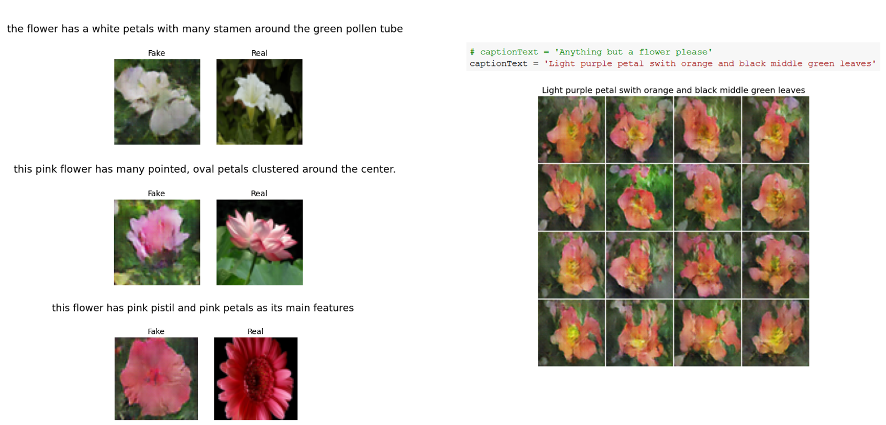

<!-- PROJECT LOGO -->
<p align="center">
  <h2 align="center">Text to Image Synthesis</h2>
  <p align="center">
    Generate images based on text descriptions, using Generative Adversarial Networks.
  </p>
  <br>
  <br>
</p>

## Introduction
This is a PyTorch implementation of an end to end Text to Image synthesis application. 

Based on [1], we train a `Char CNN-RNN` to extract useful text embeddings from (image, captions) pairs. 

Based on [2], we use these embeddings to condition a `DCGAN` on generating new and previous unseen images of the same domain, given a custom text description written by a human.
## Installation


1. Clone the repo
   ```sh
   git clone https://github.com/bojito/text-to-image-synthesis
   ```
2. Install requirements  
   ```sh
   pip install -r requirements.txt
   ```
3. Download datasets per case, as described in `data` folder


## Text Embeddings [](https://colab.research.google.com/github/bojito/text-to-image-synthesis/blob/main/1_Text_Embed.ipynb)

Based on the method presented by [Scott Reed et al](https://arxiv.org/pdf/1605.05395.pdf) we use the Char CNN-RNN architecture to build a network that trains on `(image, captions)` combinations and outputs an embedding vector that captures their underlying relationship.

First download the original weights as presented in [Reed, ICML2016](https://github.com/reedscot/icml2016).

The weights are saved as a Torch file so we use the code provided [here](https://github.com/martinduartemore/char_cnn_rnn_pytorch) to parse the weights into the pyTorch model.

## Text to Image [](https://colab.research.google.com/github/bojito/text-to-image-synthesis/blob/main/2_Text_to_Image.ipynb)

Based on the method presented by [Scott Reed et al](https://arxiv.org/pdf/1605.05396.pdf) we use a conditional GAN, conditioned on text descriptions. 

Added:
* One sided label smoothing
* Feature Matching Loss
* L1 distance between generated and real images
* FID evaluation

## Results

<p align="center">
  <a>
    
  </a>
</p>

## References

[1] Learning deep representations of fine-grained visual descriptions. [link](https://openaccess.thecvf.com/content_cvpr_2016/papers/Reed_Learning_Deep_Representations_CVPR_2016_paper.pdf)

[2] Generative adversarial text to image synthesis. [link](http://proceedings.mlr.press/v48/reed16.pdf)

[3] Improved Techniques for Training GANs. [link](https://arxiv.org/pdf/1606.03498.pdf)

## Other Implementations

* https://github.com/reedscot/cvpr2016  the authors version of Char CNN-RNN

* https://github.com/reedscot/icml2016  the authors version of conditional GAN

* https://github.com/aelnouby/Text-to-Image-Synthesis  excellent repo of Text to Image synthesis

* https://github.com/martinduartemore/char_cnn_rnn_pytorch  excellent repo on Text Embeddings
